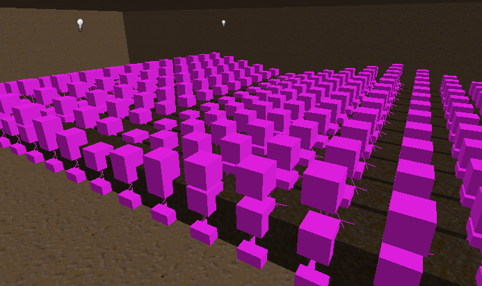
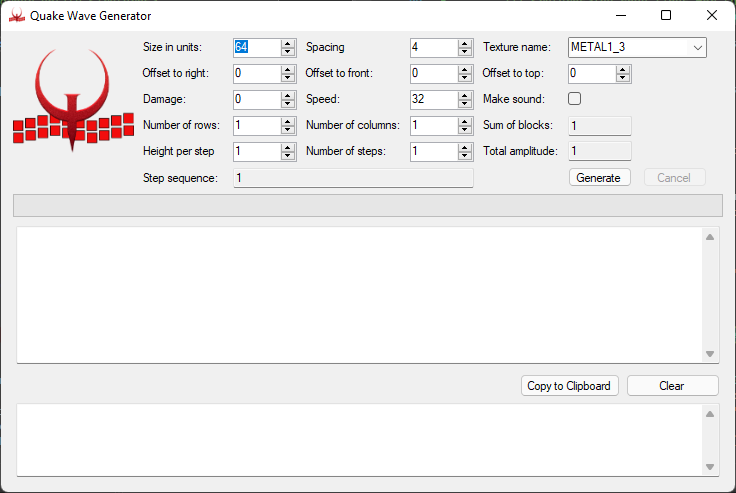

# QuakeWaveGenerator

## Disclaimer
🔴**This is still work in progress**🔴

## What this is
A Winforms application to automate the creation of multiple `func_train` "blocks", laid out in a horizontal grid where you can configure the number of "rows" and "columns". The blocks only move vertically and, by timing the amplitudes of that movement, give the impression of a wave. 

### What it looks like in a map file editor


### The Winforms application


The output of this program will be in the format as required by the Quake map file specifications, e.g.

```
{
  "classname" "func_train"
  "dmg" "0"
  "speed" "32"
  "sounds" "0"
  "target" "train_row-002_column-002_init"
  {
    (68 68 64) (68 68 0) (68 132 64) METAL1_3 0 0 0 1 1
    (132 132 64) (132 132 0) (132 68 64) METAL1_3 0 0 0 1 1
    (132 68 64) (132 68 0) (68 68 64) METAL1_3 0 0 0 1 1
    (68 132 64) (68 132 0) (132 132 64) METAL1_3 0 0 0 1 1
    (68 132 0) (68 68 0) (132 132 0) METAL1_3 0 0 0 1 1
    (132 68 64) (68 68 64) (132 132 64) METAL1_3 0 0 0 1 1
}
{
  "classname" "path_corner"
  "targetname" "train_row-002_column-002_init"
  "target" "train_row-002_column-002_bottom"
  "origin" "68 68 0"
}
{
  "classname" "path_corner"
  "targetname" "train_row-002_column-002_bottom"
  "target" "train_row-002_column-002_top"
  "origin" "68 68 0"
}
{
  "classname" "path_corner"
  "targetname" "train_row-002_column-002_top"
  "target" "train_row-002_column-002_bottom"
  "origin" "68 68 0"
}
```

### Options
You can configure (in Quake units):
- the side length of the blocks that are created
- the spacing between them
- the number of them (the product of the number of rows and columns)
- the offsets for x, y and z coordinates
- the amplitude of the wave
- the number of steps between 0 and the amplitude
- damage (if any), speed (of the `func_train` and sound (if any) -> these are the properties of the `func_train` entity
- the texture to be used

# How to use the output
The generated output is in the Quake Map File format and can - as it is - be saved in a *.map* file, e.g. `mymap.map`. Please take into account that the output only includes the blocks and the corresponding entities, so you'll have to build some walls around them and also add some lights if you want to be able to see something :-).

# Example
A Picture (or video...) says more than a thousand words:

[Example video](QuakeWaveGenerator/QuakeWaveGenerator.mp4)

# Issues
As you can enter rows and columns (mostly) as you wish, the resulting number of `func_train` entities and linked `path_corner` quickly can get pretty high. With vanilla Quake you'll soon run into the `No free Edicts` error message, meaning that the maximum number of entities (512) was exceeded. Either pay attention to that limit and reduce your overall number of entities or use an engine (e.g. QuakeSpasm) that has a higher limit (8192) or is configurable.

Another issue is that despite being configured in the right way, adjoining blocks with initially different positions in the wave cycle tend to synchronise over time. This needs more investigation though as so far it doesn't seem to behave in a reproducible manner.

# Download Binary
You can [download the (hopefully current...) binary](https://github.com/gorgsenegger/QuakeWaveGenerator/blob/master/QuakeWaveGenerator.exe).
